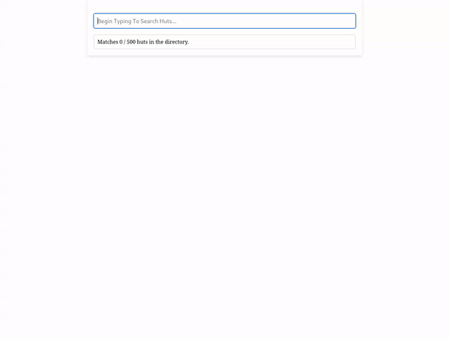

# hut finder



```
python3 -m venv .venv
source .venv/bin/activate
pip3 install -r requirements.txt
python3 manage.py makemigrations
python3 manage.py migrate
python3 manage.py shell < init_db.py
python3 manage.py runserver # visit localhost:8000/search!
```

Based on [this guide](https://www.photondesigner.com/articles/database-search-django-htmx)
